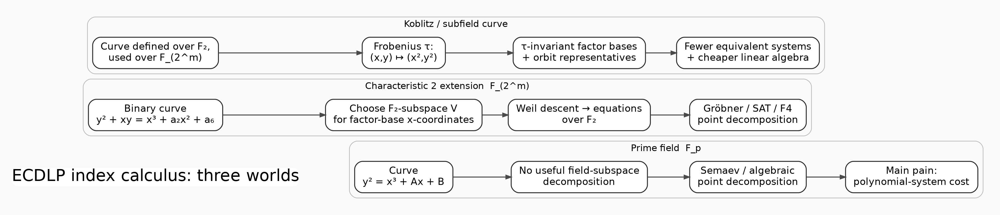
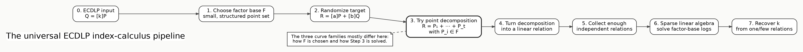
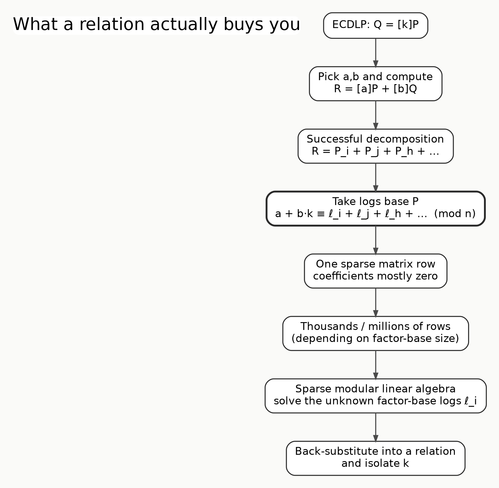
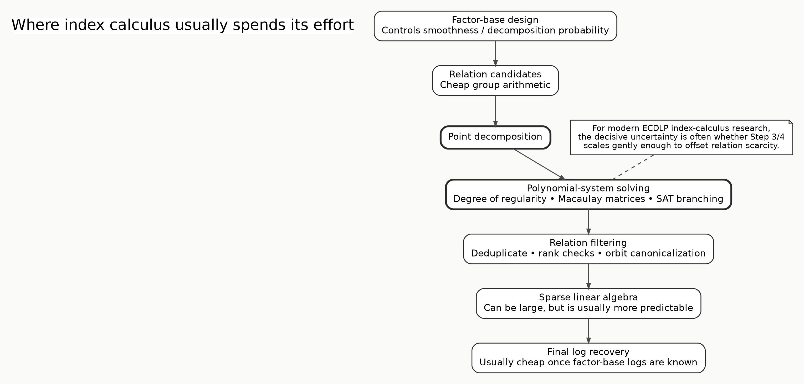
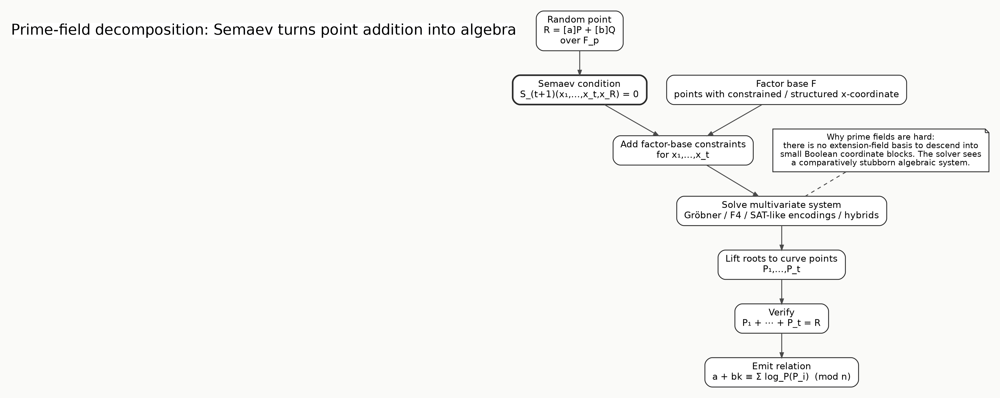
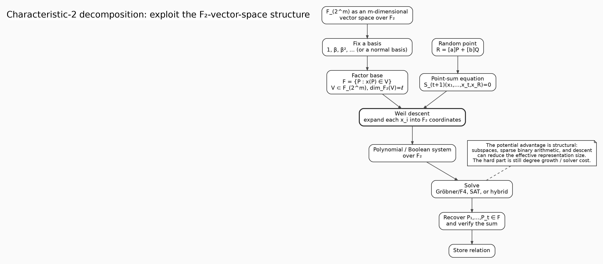
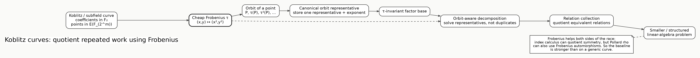

# Isogeny Labs

## Index Calculus for the Elliptic-Curve Discrete Logarithm Problem
### Prime Fields vs. Characteristic 2 vs. Koblitz Curves

*An Isogeny Labs technical explainer.*

**Scope:** defensive cryptanalysis and algorithmic research. This article compares attack structure and bottlenecks; it does not claim a practical break of modern prime-field ECC.

Elliptic-curve cryptography rests on a deceptively simple equation:

\[
Q=[k]P.
\]

You know the public points \(P\) and \(Q\). The hidden integer \(k\) is the discrete logarithm. For a generic elliptic-curve group, the benchmark attack is a collision search such as Pollard rho, whose cost grows on the order of the square root of the subgroup size.

Index calculus asks whether we can do something more structured.

Instead of searching directly for \(k\), it tries to express many curve points in terms of a smaller **factor base**, collect linear relations among the unknown logarithms of those factor-base points, and solve one large linear system.

The high-level idea is the same over prime fields, characteristic-2 extension fields, and Koblitz curves. The crucial difference is **how much algebraic structure the field and curve give us during point decomposition**.

> **Taxonomy note:** binary Koblitz curves are themselves characteristic-2 curves. They are separated here because being defined over a small subfield gives them an unusually useful Frobenius endomorphism, which changes both index-calculus engineering and the Pollard-rho baseline.

---

## 1. The universal index-calculus pipeline

Suppose \(Q=[k]P\) in a subgroup of order \(n\).

### Step 1 — Choose a factor base

Pick a structured subset

\[
\mathcal F=\{P_1,\ldots,P_N\}\subset E(\mathbb F_q).
\]

The factor base should be small enough that its logarithms can eventually be solved by linear algebra, but large enough that random points have a reasonable probability of decomposing into a short sum of factor-base points.

This tradeoff is the first central design problem.

### Step 2 — Randomize the target

Choose random \(a,b\) and compute

\[
R=[a]P+[b]Q.
\]

Because \(Q=[k]P\),

\[
R=[a+bk]P.
\]

### Step 3 — Decompose the point

Try to find

\[
R=P_{i_1}+\cdots+P_{i_t},
\qquad P_{i_j}\in\mathcal F.
\]

This is the analogue of finding a smooth integer in classical index calculus.

For elliptic curves, this is usually the difficult part.

### Step 4 — Convert the decomposition into a relation

If

\[
P_i=[\ell_i]P,
\]

then a successful decomposition gives

\[
a+bk\equiv
\ell_{i_1}+\cdots+\ell_{i_t}\pmod n.
\]

That is one sparse linear relation.

### Step 5 — Collect relations

Repeat the experiment until the relation matrix contains enough independent information about the factor-base logarithms.

### Step 6 — Solve the sparse linear system

Use modular sparse linear algebra to recover the unknown \(\ell_i\)'s.

### Step 7 — Recover the target logarithm

A relation involving \(Q\), together with the now-known factor-base logarithms, lets us isolate \(k\).

The conceptual algorithm is therefore uncomplicated. The hard research question is whether the probability and cost of Step 3 scale favorably enough to beat a generic square-root attack.

---

## 2. Prime-field curves: the algebra has nowhere to hide

Consider an elliptic curve over a large prime field:

\[
E/\mathbb F_p:\quad y^2=x^3+Ax+B.
\]

This includes the broad family containing curves such as NIST P-256 and secp256k1, even though those individual curves have additional properties of their own.

The main obstacle is simple to state:

\[
\mathbb F_p
\]

does not come with a large vector-space decomposition over a much smaller subfield analogous to

\[
\mathbb F_{2^m}/\mathbb F_2.
\]

That makes it harder to turn one large-coordinate equation into many tiny-coordinate equations.

## Semaev summation polynomials

Semaev's key idea is to encode point addition using only \(x\)-coordinates.

There are polynomials

\[
S_r(x_1,\ldots,x_r)
\]

with the property that, roughly speaking,

\[
S_r(x_1,\ldots,x_r)=0
\]

when there exist corresponding curve points with those \(x\)-coordinates whose signed sum is the identity.

So to decompose

\[
R=P_1+\cdots+P_t,
\]

one can solve

\[
S_{t+1}(x_1,\ldots,x_t,x_R)=0
\]

together with constraints forcing \(x_1,\ldots,x_t\) into the factor base.

The conceptual win is enormous: a group-law decomposition has become a polynomial-system problem.

But that merely moves the fight.

The practical complexity now depends on phenomena such as:

- the number of variables;
- the degrees after elimination;
- the degree of regularity;
- the size and sparsity of Macaulay matrices;
- the monomial order;
- symmetry breaking;
- factor-base constraints;
- whether Gröbner, F4/F5, SAT-style, or hybrid solving behaves best.

For generic prime fields, no practical index-calculus method is known that overturns Pollard rho at cryptographic sizes. That is why prime-field ECDLP remains such a compelling benchmark for experimental algebraic cryptanalysis.

---

## 3. Characteristic 2: the field itself becomes part of the algorithm

Now take an elliptic curve over

\[
\mathbb F_{2^m}.
\]

A typical ordinary binary model can be written in the form

\[
y^2+xy=x^3+a_2x^2+a_6.
\]

The crucial difference is not simply that arithmetic uses bits.

It is that

\[
\mathbb F_{2^m}
\]

is an \(m\)-dimensional vector space over \(\mathbb F_2\).

Choose a basis. Every field element can be written as

\[
x=x_0\beta_0+x_1\beta_1+\cdots+x_{m-1}\beta_{m-1},
\qquad x_i\in\mathbb F_2.
\]

This gives index calculus an extra lever.

## Subspace factor bases

A natural choice is

\[
\mathcal F=\{P\in E(\mathbb F_{2^m}):x(P)\in V\},
\]

where

\[
V\subset\mathbb F_{2^m}
\]

is an \(\ell\)-dimensional \(\mathbb F_2\)-subspace.

The factor-base constraint is therefore not “\(x\) is a small integer.” It is a **linear-algebraic constraint in the field representation**.

## Weil descent

Write the unknown \(x\)-coordinates in the chosen basis and expand the Semaev relation into coordinate equations over \(\mathbb F_2\).

A polynomial system over one extension field becomes a larger system over the tiny base field.

This is Weil descent in the algorithmic sense relevant here.

That transformation can expose:

- binary sparsity;
- linearized-polynomial structure;
- subspace restrictions;
- Frobenius structure;
- Boolean encodings;
- opportunities for SAT or Gröbner/SAT hybrids.

But there is no free lunch. The descended system can still suffer from degree growth and large elimination matrices.

The question is therefore not merely “can we descend?” It is:

> Does descent create a polynomial system whose total solving cost grows slowly enough to compensate for relation scarcity and linear algebra?

That question is highly parameter-dependent.

---

## 4. Koblitz curves: characteristic 2 plus a powerful automorphism

A binary Koblitz curve is a particularly structured subfield curve. In the classical binary setting it is defined over \(\mathbb F_2\) and considered over \(\mathbb F_{2^m}\).

A standard form is

\[
y^2+xy=x^3+ax^2+1,
\qquad a\in\{0,1\}.
\]

Because the curve is defined over the small base field, the Frobenius map

\[
\tau:(x,y)\mapsto(x^2,y^2)
\]

is an efficiently computable endomorphism.

This changes index calculus in a way that a generic binary curve does not provide as cleanly.

## Frobenius orbits

A point naturally comes with an orbit

\[
P,\tau(P),\tau^2(P),\ldots.
\]

If the factor base is chosen to be Frobenius-invariant, then many apparently distinct decomposition problems are actually the same problem viewed at different points of an orbit.

Instead of storing every point separately, one can reason in terms of

\[
(\text{orbit representative},\text{Frobenius exponent}).
\]

This can help at several stages:

1. **Factor-base compression.** Equivalent orbit elements can be represented once.
2. **Point-decomposition symmetry breaking.** The solver can avoid rediscovering Frobenius-equivalent solutions.
3. **Relation deduplication.** Equivalent relations can be canonicalized.
4. **Linear algebra.** Frobenius-invariant constructions can reduce or structure the matrix.

Work on subfield/Koblitz curves has shown that Frobenius-invariant factor bases can reduce repeated polynomial-system solving and accelerate the linear-algebra stage.

There is an important caveat.

Frobenius also accelerates **Pollard rho** on Koblitz curves because rho can run on equivalence classes induced by efficiently computable automorphisms. So Koblitz-specific index calculus is racing against a stronger generic baseline than an ordinary curve has.

This is why “Koblitz has more structure” does **not** automatically imply “index calculus wins.”

---

## 5. The comparison that matters

| Property | Prime field | Generic characteristic 2 | Koblitz / subfield |
|---|---|---|---|
| Typical field | \(\mathbb F_p\) | \(\mathbb F_{2^m}\) | \(\mathbb F_{2^m}\), curve defined over small subfield |
| Natural small base field | No useful one | \(\mathbb F_2\) | \(\mathbb F_2\) |
| Factor-base geometry | Harder to engineer | F₂-subspaces are natural | Frobenius-invariant subspaces/orbits |
| Semaev polynomials | Yes | Yes | Yes |
| Weil descent | Limited leverage | Central technique | Central technique |
| Boolean/SAT representation | Possible but less natural | Natural | Natural + orbit symmetry |
| Frobenius symmetry | Not analogous | Present as field map, but curve structure varies | Especially exploitable |
| Linear-algebra compression | Mostly generic sparsity | Field structure can help | Orbit structure can help substantially |
| Main bottleneck | Point decomposition | Point decomposition after descent | Point decomposition + exploiting symmetry |
| Pollard baseline | Generic rho + negation | Generic rho + negation | rho can also exploit Frobenius |

The key lesson is that **index calculus is not one algorithm**.

It is a family of algorithms whose performance depends on whether the curve representation exposes a useful notion of smoothness.

For integers, smoothness means factoring over small primes.

For finite-field DLP, it means factoring a field element into low-degree irreducibles.

For ECDLP, the analogue is:

> Can a random curve point be written as a short sum of points from a factor base, and can we discover that decomposition cheaply?

Everything revolves around that question.

---

## 6. Why the polynomial solver dominates the research agenda

The relation-generation loop is unforgiving.

Suppose only a small fraction of random \(R\)'s decompose. Then the system solver is invoked again and again on failed candidates as well as successful ones.

A modest solver speedup can therefore multiply across the entire attack.

But an apparent toy-field improvement can also disappear as soon as the field size grows, because the degree of regularity changes.

This is why serious experiments should record much more than wall-clock runtime:

- decomposition success probability;
- solver calls per accepted relation;
- degree of regularity;
- Macaulay matrix dimensions;
- peak memory;
- monomials generated;
- Gröbner reductions;
- SAT conflicts / propagations if applicable;
- number of relations before filtering;
- rank after filtering;
- sparse-linear-algebra cost;
- total cost per verified independent relation.

The metric that ultimately matters is not

> “Did this Gröbner basis run faster?”

It is

> **“Did the full end-to-end cost per independent relation fall, and does the scaling curve improve against Pollard rho?”**

---

## 7. Three mental models

If you want one picture to remember for each family, use these.

### Prime fields

**One large algebraic object.**

You constrain \(x\)-coordinates and ask a polynomial solver to discover a short point sum. There is relatively little field decomposition to exploit.

### Characteristic 2

**Turn one extension-field problem into many bit-level equations.**

The extension-field basis and subspace factor base become part of the attack.

### Koblitz

**Do the characteristic-2 attack modulo Frobenius symmetry.**

Do not solve the same algebraic problem \(m\) times merely because Frobenius rotated the coordinates.

---

## 8. What a breakthrough would look like

A genuinely important ECDLP index-calculus advance would likely do at least one of the following:

1. produce a factor base with much higher decomposition probability without exploding matrix size;
2. reduce the effective degree of regularity of the descended/Semaev system;
3. exploit enough symmetry that many targets share reusable algebraic work;
4. replace repeated full Gröbner solving with incremental, parameterized, or cached preprocessing;
5. find a representation in which Frobenius or other endomorphisms make the constraints nearly linear or circulant;
6. reduce the total exponent of the attack below the best generic square-root baseline on a meaningful curve family.

That is also why the most interesting experimental work is at the boundary between **algebraic geometry, finite-field representation, polynomial-system solving, and sparse linear algebra**.

---

## References for further reading

- I. Semaev, *Summation Polynomials and the Discrete Logarithm Problem on Elliptic Curves* (2004).
- P. Gaudry, *Index Calculus for Abelian Varieties of Small Dimension and the Elliptic Curve Discrete Logarithm Problem*.
- P. Gaudry, F. Hess, N. P. Smart, *Constructive and Destructive Facets of Weil Descent on Elliptic Curves*.
- S. D. Galbraith and P. Gaudry, *Recent Progress on the Elliptic Curve Discrete Logarithm Problem*.
- S. D. Galbraith, R. Granger, S.-P. Merz, C. Petit, *On Index Calculus Algorithms for Subfield Curves*.
